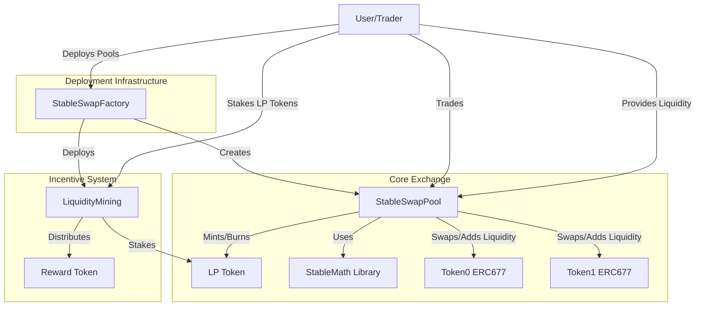

# 🚀 StableSwap AMM Implementation

    

A cutting-edge Solidity implementation of a **StableSwap Automated Market Maker (AMM)** with advanced features for optimized stablecoin trading and liquidity provision. 🌟

---

## 📖 Table of Contents

- [🌟 Overview](#overview)
- [🏗️ System Architecture](#system-architecture)
- [💡 StableSwap Concept](#stableswap-concept)
- [🔧 Core Components](#core-components)
- [🚀 Advanced Features](#advanced-features)
- [📐 Mathematical Background](#mathematical-background)
- [⚙️ Setup and Installation](#setup-and-installation)
- [🚀 Deployment](#deployment)
- [🤝 Interaction Examples](#interaction-examples)
- [🔒 Security Considerations](#security-considerations)
- [⚡ Gas Optimizations](#gas-optimizations)
- [📊 Performance Benchmarks](#performance-benchmarks)
- [📜 References](#references)
- [👥 Contributors](#contributors)
- [📜 License](#license)

---

## 🌟 Overview

This project implements a **StableSwap AMM** for EVM-compatible blockchains that allows:
- 💱 **Trading** between stablecoins with **minimal slippage**
- 💧 **Adding and removing liquidity** with proportional fee earning
- 📈 **Dynamic fee adjustment** based on market volatility
- 🎯 **Incentivized liquidity provision** through staking rewards
- 🏗️ **Scalable deployment** of multiple pools via factory architecture

The implementation leverages the mathematical principles of the **StableSwap invariant** while extending functionality with advanced features that optimize for **capital efficiency**, **user experience**, and **protocol sustainability**.

---

## 🏗️ System Architecture

The system consists of several interconnected smart contracts that work together to create a complete AMM ecosystem:



The architecture follows a **modular design pattern** where each component has a specific responsibility, enabling **flexibility**, **upgradability**, and **efficient gas usage**.

---

## 💡 StableSwap Concept

StableSwap is an AMM design specifically optimized for assets that should maintain similar values (like stablecoins). Traditional AMMs like Uniswap use a constant product formula (`x * y = k`), which works well for volatile assets but causes significant slippage for stablecoins.

StableSwap uses a **hybrid formula** that:
- 🧮 Behaves like a **constant sum formula** (`x + y = k`) when prices are close to parity, offering **minimal slippage**
- 📈 Gradually transitions to a **constant product formula** as prices diverge, providing **price stability** and preventing manipulation

This design makes it ideal for trading between stablecoins while maintaining **deep liquidity** and **low fees**.

---

## 🔧 Core Components

The project consists of the following core contracts:

1. **StableSwapPool.sol**: Main contract that handles swaps, liquidity management, and fee collection with dynamic fee adjustment
2. **StableMath.sol**: Library that implements the StableSwap invariant calculations and mathematical utilities
3. **LPToken.sol**: ERC677-compatible token for liquidity providers that represents proportional pool ownership
4. **MockERC677.sol**: ERC677 test tokens representing stablecoins for testing
5. **StableSwapFactory.sol**: Factory for deploying multiple pools with customizable parameters
6. **LiquidityMining.sol**: Contract for staking LP tokens and earning reward tokens

---

## 🚀 Advanced Features

### 1. Dynamic Fee System

Unlike traditional AMMs with fixed fees, this implementation dynamically adjusts fees based on market conditions:

```solidity
function calculateDynamicFee() public view returns (uint256) {
    // Start with base fee
    uint256 dynamicFee = baseFee;
    
    // Adjust based on volatility
    uint256 volatilityComponent = (volatilityMeasure * volatilityMultiplier) / PRECISION;
    dynamicFee += volatilityComponent;
    
    // Ensure fee is within bounds
    if (dynamicFee > maxFee) {
        return maxFee;
    } else if (dynamicFee < minFee) {
        return minFee;
    }
    
    return dynamicFee;
}
```

Benefits:
- Lower fees during stable market conditions (as low as 0.01%)
- Higher fees during volatile periods (up to 1%) to protect LPs
- Automatic adjustment without governance intervention
- Better capital efficiency and competitive advantage

---

### 2. Liquidity Mining Integration

The protocol includes a dedicated liquidity mining contract that incentivizes liquidity provision:

```solidity
function stake(uint256 amount) external nonReentrant updateReward(msg.sender) {
    if (amount == 0) revert ZeroAmount();
    
    totalSupply += amount;
    balanceOf[msg.sender] += amount;
    stakingToken.safeTransferFrom(msg.sender, address(this), amount);
    
    emit Staked(msg.sender, amount);
}
```

This feature:
- Attracts and retains liquidity in the early stages of pool deployment
- Creates additional yield opportunities beyond trading fees
- Enables strategic direction of liquidity through reward allocation
- Provides transparent APR calculation for users

---

## 📐 Mathematical Background

### 🔢 The Amplification Coefficient (A)

The amplification coefficient `A` controls the curvature of the StableSwap formula:

- 📏 Higher values of `A` (e.g., 100+) create a tighter curve with **less slippage** near the 1:1 price ratio
- 📉 Lower values of `A` make the curve behave more like a constant product formula
- ⚖️ `A` can be adjusted to balance between **low slippage** and **price stability**

---

## ⚙️ Setup and Installation

1. Clone this repository:
   ```bash
   git clone https://github.com/yourusername/stableswap-amm.git
   cd stableswap-amm
   ```

2. Install dependencies:
   ```bash
   npm install
   ```

3. Compile contracts:
   ```bash
   npx hardhat compile
   ```

---

## 🚀 Deployment

### 🌐 Local Network Deployment

```bash
npx hardhat node
npx hardhat run scripts/deploy.js --network localhost
```

### 🌍 Sepolia Testnet Deployment

```bash
npx hardhat run scripts/deploy.js --network sepolia
```

---

## 👥 Contributors

- **Mahmoud Kebbi** - [GitHub Profile](https://github.com/Mahmoudkebbi)

Want to contribute? Feel free to open an issue or submit a pull request!

---

## 📜 License

This project is licensed under the **MIT License**. See the [LICENSE](LICENSE) file for details.

---

🎉 **Happy Swapping!**